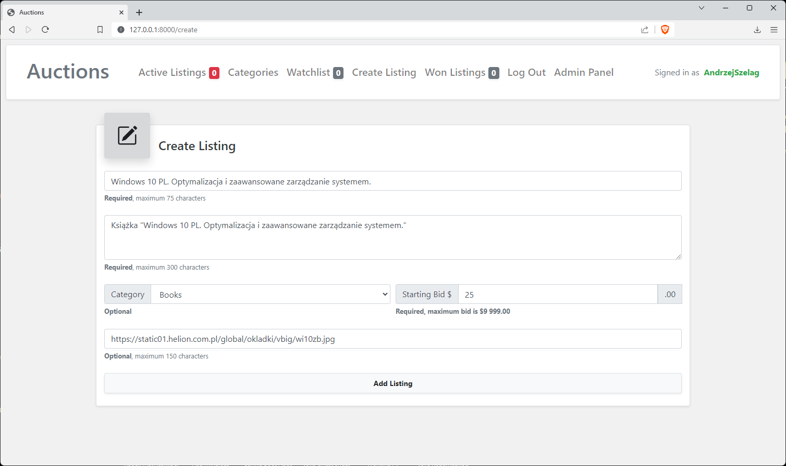

# Commerce

#### 📘 Project 2 from Edx | Harvard CS50's Web Programming with Python and JavaScript Course

✒️ Design an eBay-like e-commerce auction site that will allow users to post auction listings, place bids on listings,
comment on those listings, and add listings to a “watchlist.”

### Specification

🚀 https://cs50.harvard.edu/web/2020/projects/2/commerce/

### Video

🚀 [Commerce project on YouTube](https://youtu.be/U57J0R6fpMk)

### Requirements

* Python 3.11.1
* Django 4.1.4

### How to run? 
1. Go to the directory which contains "__manage.py__" file
2. Then type this command: __python manage.py runserver__
3. In your Web browser use a URL: __http://127.0.0.1:8000/__
